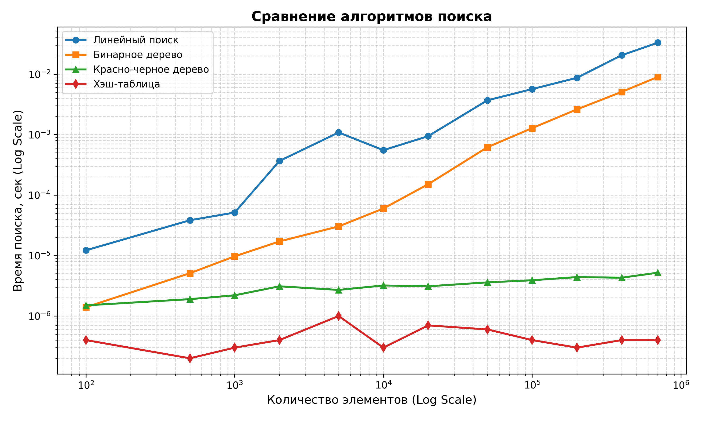

# Programming Methods Lab2

Вариант 23.

## Документация
Cгенерирована с помощью Doxygen:
* [Инструкция по коду (Doxygen)](html/index.html)

## Исходный код
* [GitHub Repository](https://github.com/bloodyEmmy/Programming-Methods-Lab2)

## График результатов
График зависимости времени выполнения алгоритмов поиска (Линейный поиск, Бинарное дерево поиска, Красно-черное дерево и Хэш-таблица) от размера входного массива:

